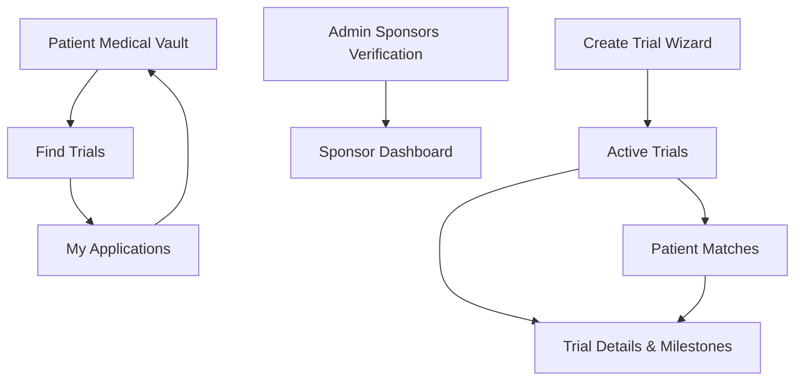

# MedVault Architecture & Route Contract

This document outlines the current page structures, role-based flows, and critical interaction contracts for the MedVault application. This serves as the primary source of truth for future UI replacements to ensure minimal regressions. 

## Canonical Route Inventory

*Note: The primary source of truth for active routes is `/src/App.tsx`. This list reflects the canonical URL mappings required to avoid breaking deep links.*

### Public / Marketing
- `/` - Landing Page (`LandingLayout`)
- `/technology` - Technology overview
- `/security` - Security & Cryptography overview

### Patient Portal (Guarded by `LayoutPatient`)
*Expects: Patient wallet state and encrypted data context.*

- `/patient/dashboard` (canonical `/patient`) - Patient overview dashboard
- `/patient/medical-vault` (canonical `/patient/vault`) - Medical vault and encrypted profile operations
- `/patient/find-trials` (canonical `/patient/trials`) - Trial discovery, apply flow
- `/patient/applications` (canonical `/patient/applied`) - Application lifecycle + reward state
- `/patient/results` - Clinical trial results and decryption logs
- `/patient/identity` - Privacy and ephemeral identity management
- `/patient/consent-logs` (canonical `/patient/consent`) - Consent logs and permission tracking
- `/patient/settings` - Patient account settings

### Sponsor Portal (Guarded by `LayoutSponsor` / `SponsorGuard`)
*Expects: On-chain sponsor verification state.*

- `/sponsor/dashboard` (canonical `/sponsor`) - Sponsor dashboard 
- `/sponsor/active-trials` (canonical `/sponsor/trials`) - Active trial management and monitoring 
- `/sponsor/trials/create` - Trial creation wizard (Data/Criteria configuration)
- `/sponsor/trials/:id` - Trial recruitment management, milestones, and payouts
- `/sponsor/patient-matches` (canonical `/sponsor/matches`) - Candidate / anonymous review queue
- `/sponsor/analytics` - Trial and patient analytics
- `/sponsor/audit-logs` (canonical `/sponsor/audit`) - System and access audit logs
- `/sponsor/profile-settings` (canonical `/sponsor/settings`) - Sponsor profile & settings
- `/sponsor/verification` - Sponsor identity verification page

### Admin & Docs
- `/admin/sponsors` - Verification and management of sponsor applications
- `/docs/*` - Comprehensive documentation routes (`DocsLayout`) including:
  - Architecture, fhe-primitives, engine, contracts, sponsor-system, client-encryption, subgraph, frontend, guides, staking, deployment, testing, security-model, compliance.

### Canonical Redirects
- `/consent` → `/patient/consent-logs`

---

## Route & Layout Ecosystem

### Shared Shell Patterns
- **Landing Pages:** Rendered via `LandingLayout` (or stand-alone).
- **Core App Pages:** Rendered via `DashboardLayout` implementations (`LayoutPatient` & `LayoutSponsor`).
- **Docs:** Rendered via `DocsLayout`.

### Role Gating
- Layout components enforce boundaries (e.g., `SponsorGuard` validates on-chain sponsor tokens/verification).
- Navigation menus map directly to the canonical route inventory (defined in `SidebarPatient.tsx` and `SidebarSponsor.tsx`).

---

## Critical User Journeys (Must Preserve)

### Patient Journey
1. **Onboarding:** Connect wallet and encrypt initial profile data in the vault (`/patient/medical-vault`).
2. **Discovery:** Find eligible clinical trials matching conditions/biomarkers (`/patient/find-trials`).
3. **Application:** Anonymous application submission utilizing relayers + Semaphore zero-knowledge proofs.
4. **Tracking:** Monitor application status through the lifecycle (`/patient/applications`).
5. **Completion:** Enroll or claim reward lifecycle post-acceptance, with decryptable results landing in `/patient/results`.

### Sponsor Journey
1. **Verification:** Verify organization status and apply for sponsor permissions (`/admin/sponsors`).
2. **Creation:** Create and fund a new trial pool (`/sponsor/trials/create`).
3. **Monitoring:** Actively monitor trial progress and cohort statistics (`/sponsor/active-trials`).
4. **Reviewing Candidates:** Evaluate anonymous candidates in the matching queue (`/sponsor/patient-matches`, `/sponsor/trials/:id`).
5. **Execution:** Update statuses, sign off on milestones, and release payout distributions.

---

## Interaction Dependency Map

## Data and State Interfaces

To preserve application stability across UI migrations, the following context and provider boundaries must remain stable:

1. **Web3/Session Providers (`App.tsx` level):**
   - `Web3Provider` (Wallet connection, chain state, active account logic)
   - `EncryptedDataProvider` (Local encryption keys, FHE primitives, Semaphore identity state)

2. **Route-Level Role Expectations:**
   - **Patient Routes:** Implicitly assume the `Web3Provider` has a connected wallet and `EncryptedDataProvider` has unlocked local data.
   - **Sponsor Routes:** Implicitly require an on-chain verification check. 

---
*Note: Existing URL paths mapping to these endpoints must remain stable or use proper `Navigate` replacement redirects during visual migration to prevent breaking deep links and user habits.*
