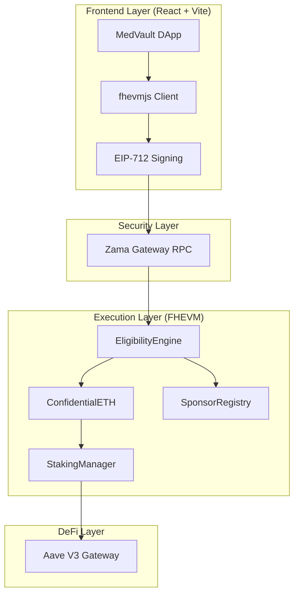
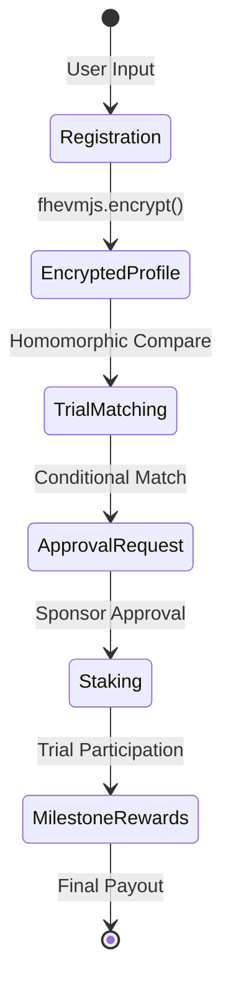
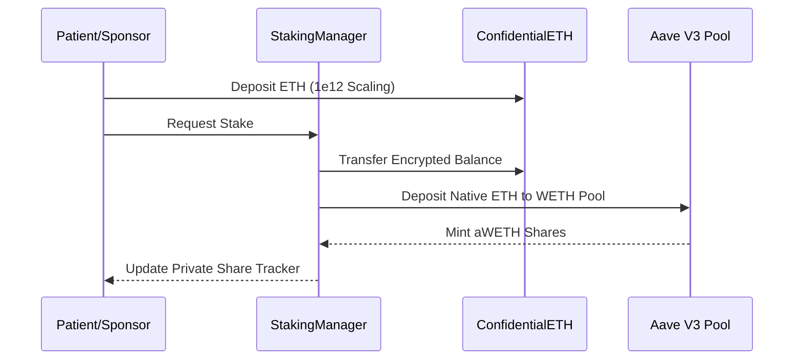

<div align="center">


# MedVault — Private, FHE-Powered Clinical Trials

[](https://zama.ai/fhevm)
[](LICENSE)
[](docs/TESTING_GUIDE.md)
[](https://vercel.com)

**MedVault** is the first decentralized clinical trial platform leveraging **Fully Homomorphic Encryption (FHE)** to bridge the gap between medical privacy and decentralized research. Built on the Zama fhEVM, it allows patients to match with life-saving trials while keeping their medical data mathematically encrypted at all times.

</div>

---

## 🔒 The FHE Difference

Traditional clinical trials require patients to leak sensitive data to determine eligibility. MedVault reimagines this with an **Encrypted-by-Default** architecture:

*   **Zero-Knowledge Discovery**: Trial matching happens entirely on ciphertexts. The network computes `Age > 18` and `HbA1c < 7.0` without ever seeing the raw numbers.
*   **Encrypted Yield**: Idle reward funds are staked into Aave V3 via our `StakingManager`, allowing private incentive pools to grow while maintaining absolute confidentiality.
*   **Regulatory-First Audit**: A dedicated `DataAccessLog` provides on-chain proof of compliance (who accessed what) without compromising patient identity.

---

## 🏗️ Technical Architecture

MedVault uses a multi-layered approach to synchronize browser-level encryption with on-chain computation.

### System Overview


### Data Lifecycle State Machine


---

## 📜 Smart Contract Suite

MedVault's core logic is distributed across a modular set of FHE-aware smart contracts:

| Contract | Purpose | Key Feature |
|-----------|---------|-------------|
| **`EligibilityEngine.sol`** | Core Matching Logic | Homomorphic (CMUX) boundary checks. |
| **`ConfidentialETH.sol`** | Privacy Wrapper | 1e12 scaled `euint32` encrypted balances. |
| **`StakingManager.sol`** | De-Fi Integration | Native Aave V3 yield on private assets. |
| **`SponsorIncentiveVault`** | Reward Governance | Automated milestone-based phased payouts. |
| **`DataAccessLog.sol`** | Compliance Audit | Immutable, anonymized access tracking. |
| **`TrialMilestoneManager`** | Lifecycle Management | Phased trial progress tracking. |

---

## 💰 Private Staking Workflow

MedVault integrates with **Aave V3** to allow sponsors and patients to earn yield on their confidential assets.



---

## ✅ Verification & Assurance

We maintain a rigorous quality standard. The system is verified by a **100-case comprehensive stress test suite** that validates every edge case in the FHE environment.

*   **Success Rate**: 100/100 Tests Passing.
*   **Coverage**: Eligibility Engine, Staking Consistency, Reward Distribution, and Access Control.
*   **Environment**: Standardized for local Hardhat and Zama Mock FHE.

```bash
# Run the verification suite
npx hardhat test test/comprehensive_medvault.test.js --network hardhat
```

---

## 🚀 Getting Started

### Prerequisites
*   Node.js (v20+)
*   Metamask with Zama Sepolia Testnet configured.

### Local Installation
1.  **Clone & Install**:
    ```bash
    git clone https://github.com/your-repo/medvault.git
    cd medvault
    npm install
    ```
2.  **Environment Setup**: Create a `.env.local` file:
    ```bash
    GEMINI_API_KEY=your_key_here
    ```
3.  **Run Development Server**:
    ```bash
    npm run dev
    ```

### Vercel Deployment
MedVault is pre-configured with a `vercel.json` to handle the critical security headers (**COOP/COEP**) required for FHEVM WASM execution. Just import the repo into Vercel and it works out of the box.

---

## 📄 Documentation
For deep technical dives, check out our internal documentation portal or the following guides:
*   [Testing & Verification Guide](docs/TESTING_GUIDE.md)
*   [New Contract Development Guide](docs/NEW_CONTRACTS_GUIDE.md)
*   [Upgrade Roadmap V1.1](docs/UPGRADE_V1.1_PHASED_PAYOUTS_AND_AUDIT.md)

---

<div align="center">
Built with ❤️ for the future of Medical Privacy.
</div>
